# Architectural Components of Azure
## Azure Regions
### Understanding Regions
Where is Azure ?
How is it physically organized ?

Microsoft def: region is a set of datacenters deployed within a latency-defined perimeter and connected through a dedicated regional low-latency network.

Set of datacenters
Latency-defined perimeter

Geographically distributed groups of datacenters

two or more data centers not too far from each other connected with a high speed connection

some regions have a single datacenter

Multiple regions strategically located worldwide

### Connectivity
Microsoft Private global Fiber Network

### Example West US 3
Multiple datacenters grouped together
each datacenter is independent from each other

### How to choose a region
You can select the region for deploying Azure resources
- Location : Choose a region closest to your users to minimize latency
- Features : Some features aren't in all regions
- Price : The price of services varies from region to region

You will often have to choose which is the most important among all of them

### Region Pairs
Two closely linked regions for redundancy and replication => High availability
Exist to provide an extra layer of protection against unexpected events

- Each Region is Paired (except Brazil South Region)
- Outage Failover
- Planned Updates
- Replication

### Sovereign regions
Isolated regions ensuring government compliance within specific jurisdictions
- Not part of Azure public cloud
- Approval required to join
- Not all services available

Azure for US Government
Azure China

### Azure for US Government
Meets higher compliance requirements
A cloud for mission accross data classifications
Eligibility : US government entity or solutions provider (federal, state, local or tibal governments, government contractors)

### Azure China
Isolated regions required for Azure workloads in China
Operated by third-party provider (21Vianet)
Data stays in China's datacenter to ensure compliance
Requires business presence in China

## Availability Zones
### What are Availability Zones ?
Physically separate datacenters within an Azure region
- Physical Location : 1+ contained datacenter within a region
- Independent : Each zone has its own power, cooling and networking
- Zones : Minimum of three zones

### Visual representation
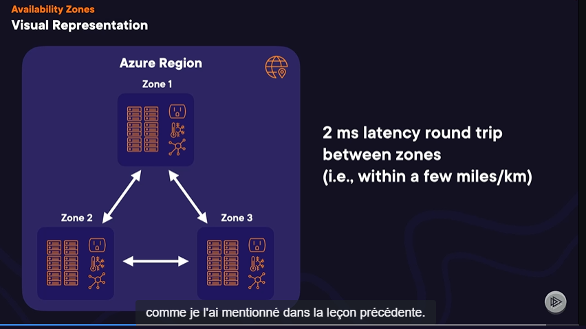

### Regional Availability
Not all regions have availability zones
At least one zone-enabled region per country with Azure presence
More zone availability becoming available

### Using Availability Zones
Goal : Redundancy within a region
Solution/service replicated across multiple zones

If one zone goes down, service still operational.

Methods :
- Zonal services : Associate a resource with a specific zone (Example : Deploy a VM to Zone 2)
- Zone redundant services : Service automatically replicates across zones (Zone-redundant storage account)

Duplicating services accross zones come with additional costs.

## Exploring Azure Global Infrastructure
Explore : https://datacenters.microsoft.com/

### 
### 
### 
### 
### 
### 
### 
### 
### 

## Resource Organization
### 
### 
### 
### 
### 
### 
### 
### 
### 

## Resource Hierarchy
### 
### 
### 
### 
### 
### 
### 
### 
### 

## Exam tips
### 
### 
### 
### 
### 
### 
### 
### 
### 

# Azure Compute
## Azure Compute Concepts
Covers both Iaas and Paas

### Defining Compute
On-demand computing service that provides computing resources (disks, processors, memory, networking and OS)

Engine running your code/applications on Azure

### Azure Compute Options
Different options for different requirements

Iaas : VM
Paas : Azure App Service, Azure Functions, Azure Container Instances, Azure Kubernetes Services

### Revisiting Iaas vs Paas
Flexibility vs Management Overhead
Iaas : Greater customization/control, more managment overhead
Paas : Less customization/control, less management overhead

## Virtual Machines
### What is a VM?
Customizable, scalable and on-demand server
=> Iaas
=> Virtualized server : hosted on underlying hypervisor, full control over it, run almost any application
=> Windows or Linux servers syste,s

### Components
- CPU/Memory
- Disk
- Networking
- Operating System (Linux or Windows)
- Network controls (firewall)

### VMs and networking
All VMs must be deployed to a Network
=> Virtual network (VNet)
Not possible to create a VM without assigning it to a network
Includes one or more subnets
VM assigned private and public IP address(es) : private requires, public optional; attached to network interface card (NIC)

### Configuration
- Choose CPU, RAM and Disk Configurations
VM Size = Preconfigured CPU/RAM combinations
- Optionally, GPU and Disk types
- VM Sizes grouped into series (Examples: A series, B series, D series) : different series for different use cases
- Configure Disks (various sizes)

### Description of VM series
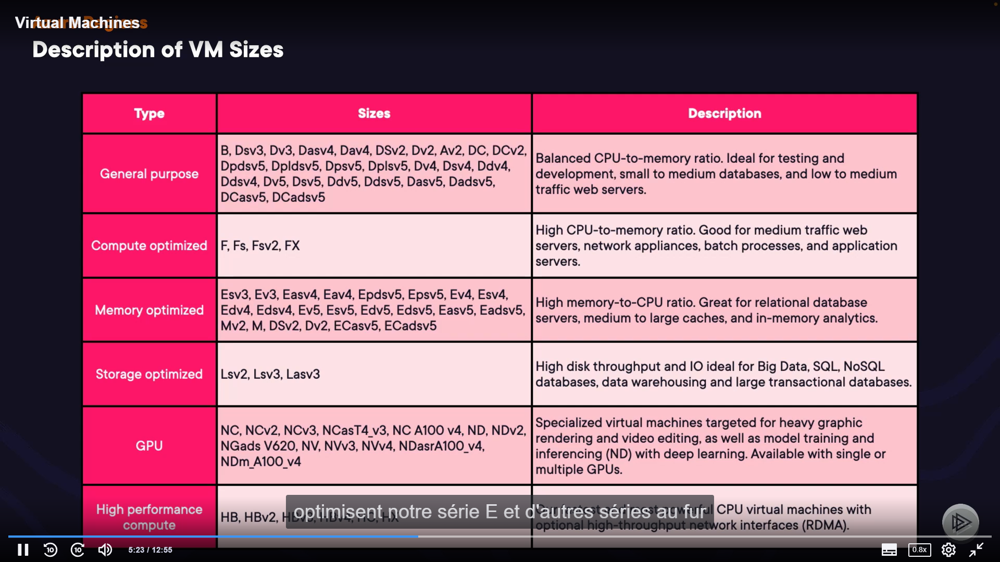

### VM Pricing
Different pricing for different components
CPU/RAM (Compute)
- Priced by the minute
- More compute = higher costs
- Deallocated (stopped) VMs not charged for compute

Disks
- Charged whether VM is running or not

Licensed OSs
- Windows, Red Hat, etc
- Pay-as-you go license charged same as Compute

Public IP Address(es)
- Charged by the hour
- Pricing model depends on SKU
Dynamic: No charge when VM deallocated
Static: charged regardless of VM state

### Use cases for VMs
Pros:
- Control : use VM when you need to control all aspects of an environment or machine
- Application Compatibility : Install specific applications on your Win or Linux machines, better legacy support
- Existing infrastructure : existing resources and VMs can be moved to Azure from on-premises or another cloud provider. "Lift and Shift"
- Testing and development : quickly and easily test applications and configurations, when done, simply delete the VM
- Extend your datacenter : extend your on-premises servers to work with Azure VMs, hybrid cloud.

Cons:
- More stuff to manage : much more management overhead, OS updates, patches, user control, software environments
- Higher costs : Specialize services for cloud-native applications often cost less
- Complexity in Scaling : scaling is often a more manual process

### Creating VMs
Resource organization
Required region to assign
Options
Open ports

Available in Quick Launch or search for VMs in search bar

Create a VM
Must assign to : region, resource group, network
Options : VM size, OS, Disks, and much more

Basics
- Subscription
- Resource group
- VM name
- Region
- Availability options (not required) => no infrastructure redundancy required
- Availability zone
- Security type (optional)
- Image : OS on which VM will be running
- Size : Number of CPU/Memory coniguration (B series, the cheaper one, general purpose|)
- Username
- Password
- Authentication type (for Linux only) : SSH public key or passwords
- Public inboung ports
- Select inbound ports

Disks
- Later on

Networking
- Virtual network
- Subnet
- Public IP (optional)
- NIC network security group (optional)
- Public inbound ports
- Select inbound ports

Management
- Enabling Microsoft Defender for cloud
- Login with Azure AD

### Connecting to VMs
Windows RDP port 3389
Linux SSH port 22

Windows:
- RDP : Remote Desktop
- 4 more ways to connect : Bastion basic or standard, Windows admin center, Native SSH, Serial console

Linux :
- SSH using Azure CLI : easy connect method
- Native SSH

## Deploying your first Azure VM
### Create a VM
From Homepage, click on create a resource.
Under "Virtual Machine", click on create

## Virtual Machine Scale Sets
### What is VMSS
Auto-scaling groups of identical VMs
Ability of create and manage multiple, load-balanced and identical VMs.

### Problem to solve
Too much load/traffic for server to handle

### How does it work
Multiple identical VMs
- Identically configured
- All managed from the same place

Behind a Load Balancer
- Directs traffic to available VMs
- Single frontend for users (e.g. a single website address)

Increase/decrease VM count
- Can automatically or manually adjust count
- Horizontal scaling

### Benefits
Multiple identical VMs: simple to manage using a load balancer
High availability : zone-redundant, deployed accross multiple zone in single region
Auto-Scaling
Large Scale : Up to 1000 VMs in a single scale set
No extra cost

### Creating Cloned VMs
From Baseline image : 
- Capture image from baseline/reference VM
- Scale Set VMs crated from captured image

Configuration script at startup
- New clone VM runs configuration script on first boot

Combination of both
- Reference image + additional configurations

## Availability Sets
### Purpose
Provides a method for high availability for static VMs in Single Datacenter/Zone

Differences compared to Scale Sets:
- Non-identical VMs
- No auto scalling
- Single datacenter/zone

### Breaking down
It provides logical grouping of VMs with separate Fault and Update Domains for high availability.

### Fault Domain
Underlying hypervisor or multipple hypervisors with common power source/network switch.

example: hyoervisors on same server rack
VMs on hypervisor with same power/networking = single fault domain

### Update domain
Groups of hypervisors (and VMs) that can be rebooted at same time

Planned hypervisor maintenance updates 
Not dependent on physical rack/location

Two VMs in same ipdate domain may be both be temporarily unavailable

### Spreading VMs across Update/Fault Domains
Adding static VMs to an availability set ensures VMs are placed:
- On hypervisors with separare maintenance windows
- On hypervisors on different server racks
=> High availability in case of power supply failure and/or rolling hypervisor updates

### Max limits
- 20 Updates Domains for your VM
- 3 Fault domain

### When to use availability sets
High Availability for multiple unique VMs that don't need auto-scaling

## Azure Virtual Desktop
### Definition
Provides virtualized windows desktops and apps hosted on Azure
- Virtual Desktop Interface (VDI) powered by Iaas (Vm) similar to Citrix
- Access from any device
- Separates OS, data and apps from local hardware
- Centrally managed and secure

### Problem to Solve
How to securely enable a remote Workforce ?

1. Data Security : secure data accessed from many locations
=> All data centrally stored in Azure includes desktop and apps

2. IT Overhead : manage multiple user desktops can be a nightmare
=> Apps, updates and settings centrally managed
=> Use existing Windows 10/11 licenses

3. Software consistency : making sure all users have consistent software and updates
=> Easily add more VMs to host pool
=> Multi-session environments

4. Scalability : Support growing workforce
=> Windows, Mac, mobile devices and web browser

### How it works
All resources are centrally hosted in Azure
Configuration, Access and Diagnostics
VM Host Pools

### Use cases
Remote Workforce enablement : Remote workspace environment from anywhere, no need for company hardware (BYOD: bring your own device friendly)

Secure Data Handling for healthcare : Secure, controlled access to sensitive patient data, reduced risk of data breaches, simplifies healthcare compliance

## App Services (Paas)
### Definition
Fully managed application hosting with minimal managemen overhead
Bring your code and Azure handles the rest.
No managing infrastructure.

### Things you don't have to manage
OS
Web server applications
Network management
High availability
Disk management
Load Balancers
Scaling

### Focus on What matters
Business Value and Your Code

### App Service hosting capabilities
Web Apps
- Support most languages
- Deploy static web apps
- Deploy containers
- No need to install/configure web server software
- Acccessible via Azure portal

WebJobs 
- Background tasks for application logic

API Apps
- Host your REST-based web API

Mobile Apps
- Backend for iOS/Android apps
- Authentication, mobile app data and push notifications

### Configuring and deploying app service (Web app)
Choose a unique name (must be unique across all of Azure)
Choose publish  (Code, container, static web app)
Choose a service plan (performance, scaling, disk space and more)
Deploy your code (Tight integration with github + other methods, support continuous deployment for rapid iteration)

## Azure Functions
### Definition
Serverless event-driven code execution

Extreme Paas : pratically zero management overhead
No VMs to manage
Apps only run when triggered

### What are Azure Functions
Sometimes referred to as functin as a service
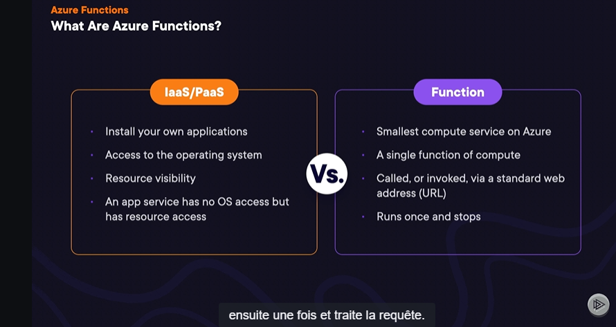

### Architecture
Use VMs to work on
but no maintenance
nothing VM-related
Just focus on your functionality

### Use Case
Automated Image Resizing upon upload
Image uploaded to website => triggers an Azure Function Resize => Display on website

### Benefits
- Only runs when needed : event-driven (when an event triggers that function to run)
- Saves Money : no resources running means you don't pay for the function when it is not used
- Resilience : If your function fails, it doesn't affect other function instances
- Scalability : No configuration required, auto-scales based on demand, scales down to zero and up to your determined cap
- No infrastructure management : just deploy your code

## Introduction to Containers
### Definition
Lightweight, standalone package for apps
bundled application + dependencies : portable, self-contained unit, isolated from host OS

### Benefits
Manage Application Dependencies 
Less overhead
Increased portability
Efficiency
Consistency

### Containers vs VMs
Additional layer of virtualization:
- VMs: virtualized hardware
- Containers : virtualized OS : bild on top of host OS's kernel, can contain only services needed for application

### Container Workflow
Develop Application -> Application/Dependencies/execution/instructions packaged in a container -> Deploy container

## Container Deployment Options
### ACI : Azure Contaier Instances
- On-demand : use containerized applications to process data on demand, by only creating the container image when you need it
- Simplicity : minimum setup/overhead required, ideal for short-lived, simple workloads
- Not as scalable : single containers only, no load balancing/auto-scaling

### Azure Kubernetes Service (AKS)
Kubernetes : open-source container orchestration

- Orchestrate many containers : manage large scale, high volume, high complexity containerized workloads
more control and customization
- Scalability: automatic scaling, load balancing, and failover
- More complex + higher costs : persistent VMs nodes, between Iaas and Paas, much more complex than ACI

### Azure Container Apps
- In between ACI and AKS
- Serverless and scalable: ideal for serverless microservices, auto-scaling enabled
- Not quite as powerful as AKS : less customization

### Other deployment options
VMs : You can do anything with VMs, much more to install, manage, configure
Azure App service : ideal for long-running web applications, use any programming language
Azure Functions : Containerized event-driven applications, use any programming language

# Azure Networking
## Virtual Networks
Central construct for private ad public communications
VNets bound to a region : one or more address spaces, subnets contained in address space
IP Addressing : VMs mus have private IP, public optional

### Core of Azure Networking
Virtual network (Vnet) : private, isolated network in Azure
- Home for all VMs
- Vm isolation/communication boundary
- Private and public networking
- One or more address spaces -> One or more subnets

### Adress Spaces and Subnets
Address Spac : Vnet overall IP range
Example 1: vnet-1 : 10.0.0.1 - 10.0.255.255

subnet-a, subnet-b and subnet-c

Subnet : segnmented, smaller IP adresses within an address space

- Resource grouping
### IP Address
Unique identifier for network devices

Private IP : Local network identifier => invisible to outside world (10 /8 prefix, 172.16 /12 prefix, 192.168 / 16)
Public IP : Global network identifier

### VM IP Configurations
Private IP required, public IP optional
Static vs Dynamic Public IP => Public IP changes upon VM deallocation/reallocation
Static Public IP remains upon VM deallocation/reallocation (most expensive)

### VNet Regions and Subscriptions
Vnet is bound to a single Region. Every resource on the VNet must be in the same region too.
SUbscriptions : VNet belongs to just one subscription, but a subscription can have multiple VNets

### Cloud Advantages
Software defined networking => Vnet is virtual because when you get access to it, you don't have access to any underlying hardware.

Network components are software cof
No physical constraints - network is virtualized

Scaling Vnets : Adding more Vnets or more addresses is saimple
High availability : peering Vnet using a load balancer or using a VPN gateway all increase availability
Isolation : manage and organize resources with subnets

### VNet : Communication Nerve Center
Public Networking Public address IPv4 and IPv6
Intra VNet: communicate privately with other Vnet resources
Managed Services: public an private network communications
Peering : private peering between Azure VNets
Hybrid networking: Private networking with on-prem or other clouds
Security : All communications can be filtered (Network security groups - NSGs)

## Network Security
### Exam Scope
Not on current version of AZ-900 exam

### Network Security Group (NSG)
Primary traffic filter for subets/VMs
- Applied to subnet or individual VM
- Free service
- Granular rules for fine network control
    - Inbound/outbound filters
    - Traffic types (TCP/UDP ports, ICMP)
    - Allowed sources/destinations
    - Allow or deny multiple types or traffic
    - Priority of overlapping rules
- Example : Only allow RDP (TCP:3389) access from corporate office

### Azure Firewall
Advances firewll service for multiple networks
- Centralized traffic control for multiple VNets
- Paid Service
- More advanced than NSGs
    - Threat intelligence
    - Advanced filtering rules
    - URL filtering
    - DNS proxy
    - On-premises network integration

### Azure Bastion
Secure SSH/RDP access for private VMs with no public address
- Connect VMs with no public IP
    - Managed "jump server"
- Fully managed service
- Deployed to VNet
    - Specific subnet name required
- Connect via RDP/SSH via web browser or native client

## Creating Virtual Networks
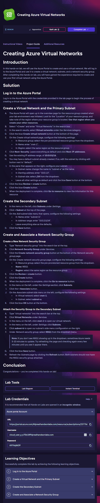
VMs must be in the same region of VNet

## Network Peering
### Challenge : COnnecting Multiple VNets
Connect multiple VNets to act as single network
Extend private networking to other Azure regions
Keep all traffic on Microsoft backbone

Solution: Virtual Network Peering

### Big Picture
Mechanism to maintain private connectivity across Azure VNets

- Expand Azure Network Private Connectivity
    - Extend connectivity across multiple VNets
- Secure Traffic
    - All traffic stays on Microsoft's private backbone
- Extend reach
    - Peer across regions, subscriptions and tenants

### Benefits
- Speed : Low latency, maximum bandwith allowable per VM
- Traffic Privacy : Traffic stays on Microsoft private backbone, not exposed to public internet
- Control Traffic between VNets : NSGs, Custom Routes

### Scenario : Multi-national Presence
E-commerce company expansion :
Headquartered in North America, expanding Azure presence to Longon and Tokyo
Need to sync data between regions : Inventory, user data, analytics
Peering synchronizes data quickly and securely : traffic stays on private backbone, update data in real time

## Azure DNS (Domain Name System)
### Definition
Translates domain names to IP Addresses
=> The phone book of the internet => use easy-to-remember names
=> public or private phone book
=> public or private network/IP translation
=> If DNS stops working, everything stops working

### DNS Resolution Basics
=> Connection request resolved by DNS host/server
### Public vs Private DNS Resolution
- Public = public domain registrar -> authoritative name server
- Private = private DNS server/host => not authoritative name server

### Azure Public and Private DNS Services
Public DNS :
- Azure DNS Zones : use Azure as authoritative name server

- Private DNS :
- Azure Private DNS Zones : Custom DNS resolution within VNets

=> Global services, not tied to a single region

### Benefits
- Uses the same tools/credentials/billing as other Azure instances
- RBAC for access management
- Activity monitoring
- Resource locks to prevent changes

## Hybrid Networking
### Definition
Connecting trusted external networks over private IP networking

- On-premises
- Other cloud networks
- Other Azure VNets

Benefits :
- Extend private networking beyond your VNet
- Encrypt traffic between networks

### Azure Hybrid Connection Options
Site-to-Site (S2S) VPN
- Network to Network
- Connect over IPsec/IKE
- Uses public internet
- Can connect to other Azure VNets

Point-to-Site (P2S) VPN
- Azure network to individual computer
- Ideal for telecommuters
- Also over public internet

ExpressRoute
- Direct, private connection to Microsoft services
    - Not over public internet
- Lease dedicated over private carrier

### Virtual Network Gateway
Core component of all Azure hybrid connectivity solutions
Managed Azure resource hosted in VNet
Endpoint connecting VNet and hybrid connection option
One Network Gateway per VNet

## Azure VPN
### Site-to-Site VPN - Network-to-Network
Encrypted network-to-network connection over public internet

VNet Gateway + VPN becomes a VPN Gateway

### S2S VPN Components 
- VPN Gateway resources : Create the tunnel to target on-premises IP addresses
- Local Network Gateway : receives the message to connect on a specific IP address on th On-premises network

### Point-to-Site (P2S) VPN : Network-to-Computer
Encrypted Network-to-Device Connection over Public Internet
Ideal for remote workers who need private networking access

### VPN Types : Policy-Based vs Route-Based
Policy-Based 
- Most backwards compatible
- Only supports Static routing
- No Point-to-Site VPN
- Connct to single site
vs
Route-Based(more capabilities)
- Not as backwards compatile
- Dynamic routing
- Supports Point-to-Site VPN
- Connect to multiple sites

### VPN and High Availability
Behind the scenes : Gateway = two managed VMs running connection
Active-Standby : Default configuration : one VM running one tunnel. If one VM fails, other takes over after slight delay
Active-Active : Two active tunnels, maximum high availability, additional configuration requirements

### Peering vs VPN to connect Azure VNets
Peering
- Faster and less expensive
- No encryption between networks
- Traffic stays on Microsoft backbone
- Lower latency
- Maximum bandwidth between networks
- Less expensive, less to manage

VPN
- Provides encryption between networks
- Involves public internet
- Network gateway manages traffic
- Bandwidth limited, more hops
- Ideal for security and compliance
- Network gateway = additional costs
- Have a higher monthly cost

## ExpressRoute
### Definition
Private, Fast connection to Microsoft Cloud
- Private, leased lines into Microsoft's network
    - Not over the public internet
    - On-premises connections only
- Often partner with connectivity provider
- Privately connect to VNets and other Microsoft Cloud services

Benefits :
- Reliable and fast connection
    - Built-in redundancy (active-active)
- High speed options available

### VNet Setup
=> ExpressRoute not just for VNets
Same Virtual Network Gateway as VPN
- Same subnet naming requirement
- configured as ExpressRoute Gateway vs VPN Gateway

=> Gateway connects to ExpressRoute Circuit
- ExpressRoute Circuit = Azure resource connecting to private connection

### Infrastructure
- Partner Edg : service provider routers that connect to you network
- MS Edge: Edge routers on Microsoft's side of ExpressRoute circuit

### ExpressRoute vs VPN
- Faster
- Cost more
- More permanent
- More Private

## Public and Private Endpoints
### Public endpoints = publicly reachable PaaS Services
- Maaged PaaS Services reachable over the public interney
    - VNet : PaaS over public internet
    - Also exposed to the public
    - problem with sensitive resources

Limit or remove public exposure ?
- Remove public endpoint/enable private networking

### Private endpoint
Managed network interface
- Private connection to specific instance of a service (private storage account, private databases)
Available over connected networks
- Hybrid/on-premises networks
- Peered virtual networks
Can completely disabl public access to a connected service
- Truly private
- Public endpoint disabled

### Scenario
VPN connection from corporate office to Azure VNet named hub-vnet
Must privately access sensitive storage account from corporate office : Disable public internet exposure

Solution : a private endpoint
- privately connects hub-vnet to storage account
- private access from corporate office
- can also disable public access for truly private connection

## Exam Tips
Azure VNet : private, isolated netwotk in Azure
=> Requird for all VM   
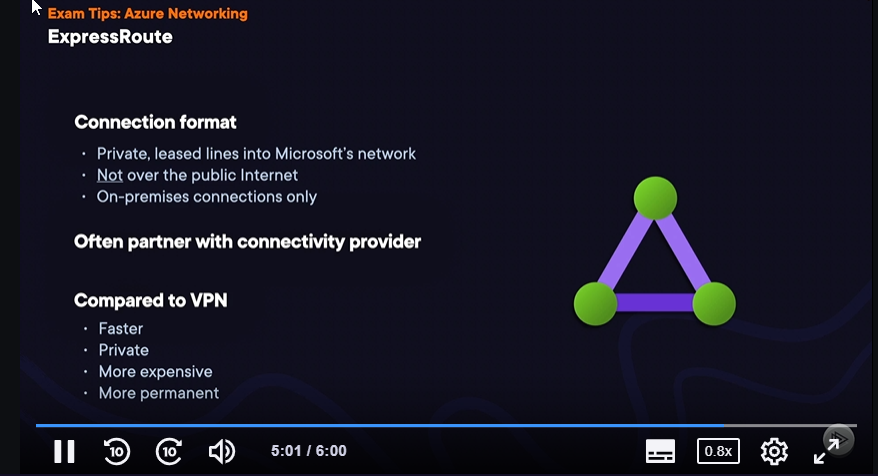

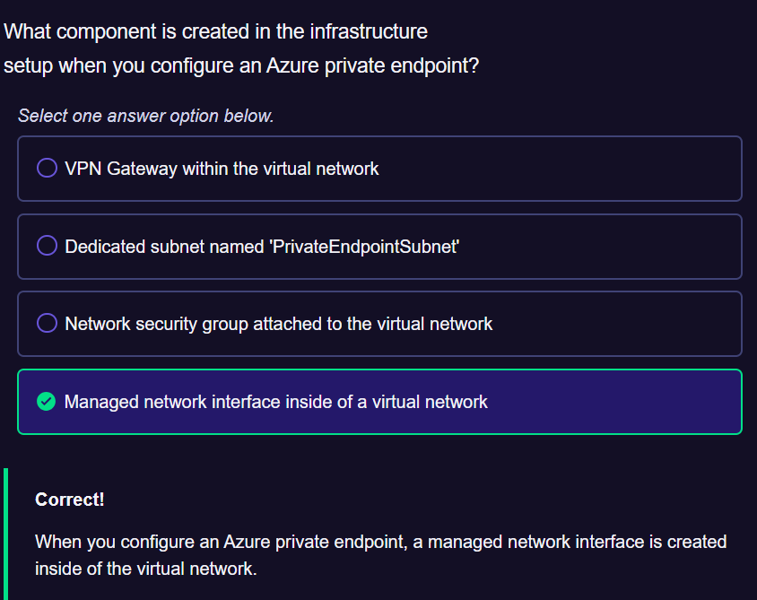
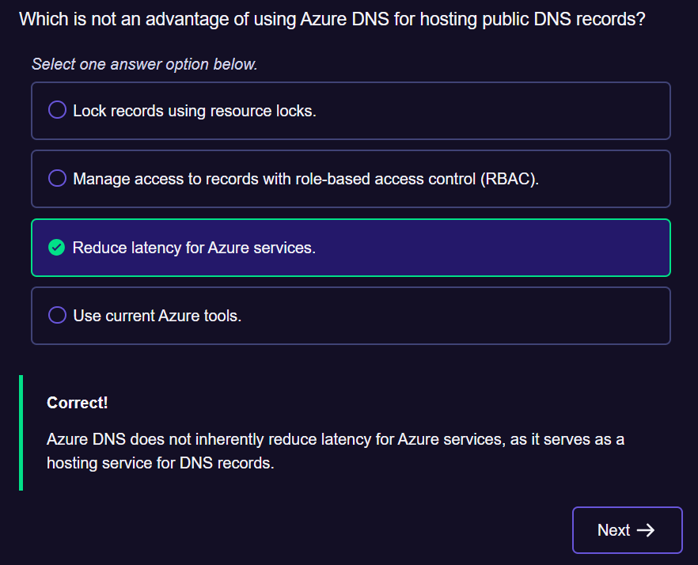
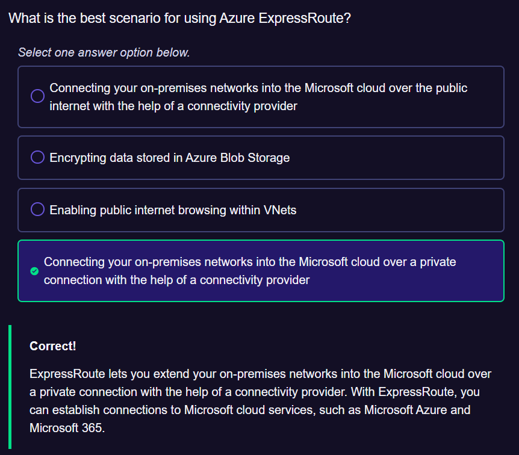
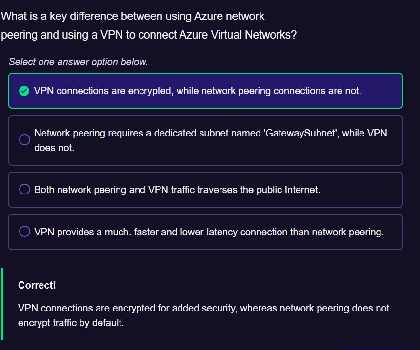
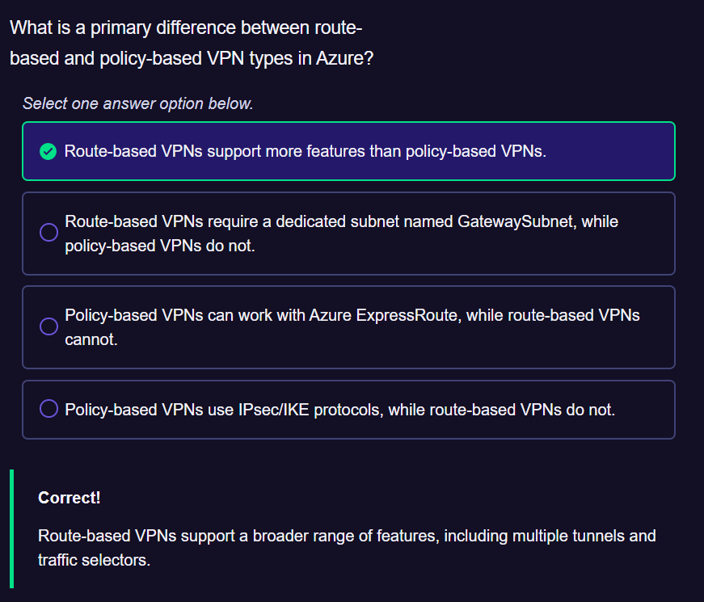
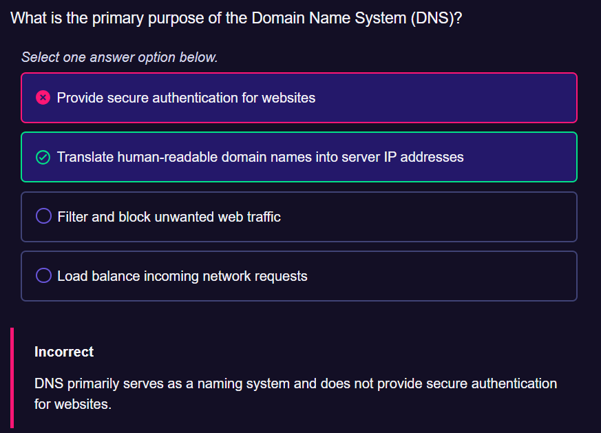
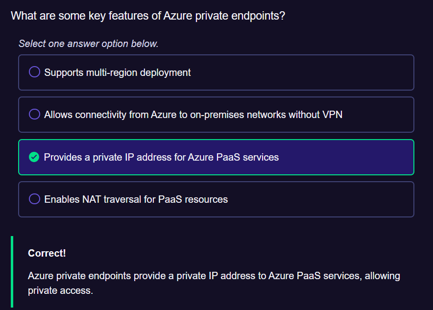
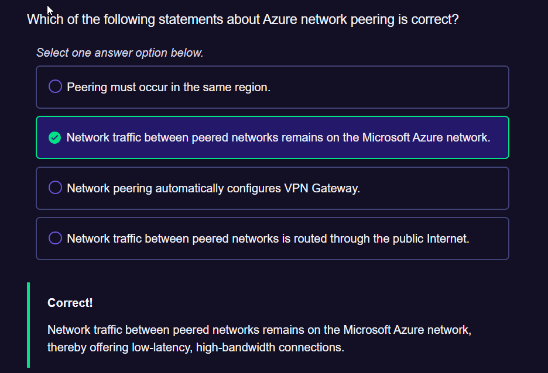
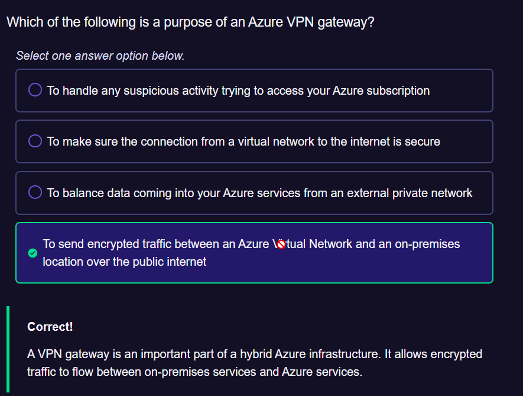
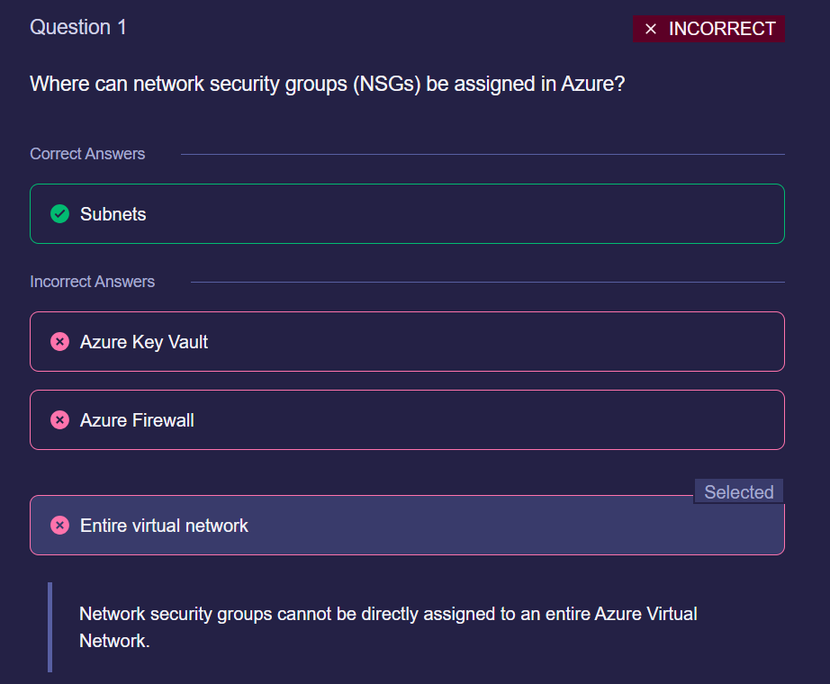
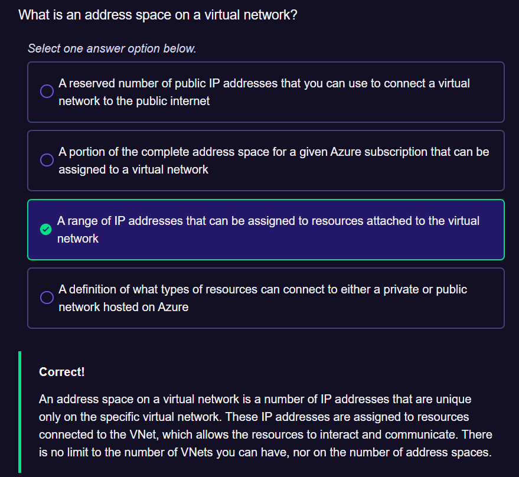
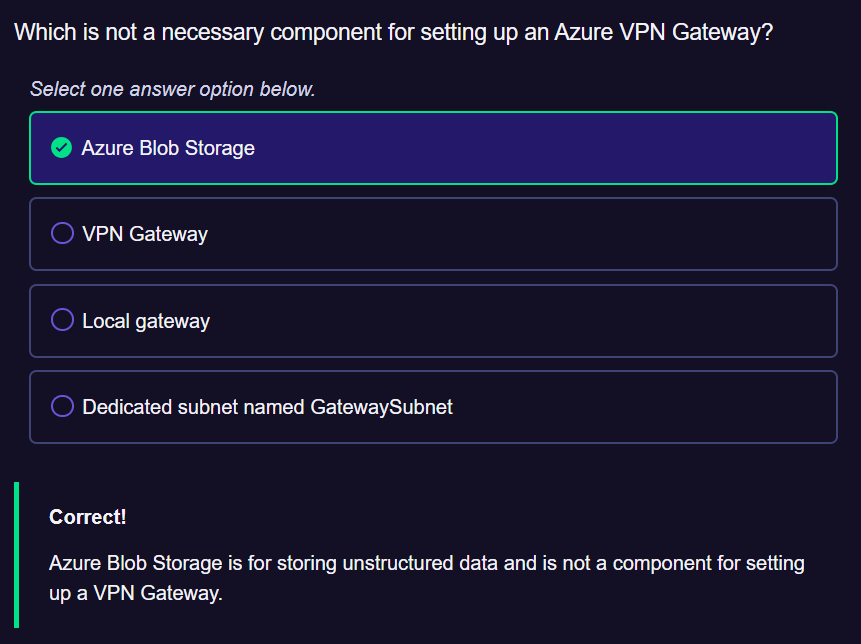
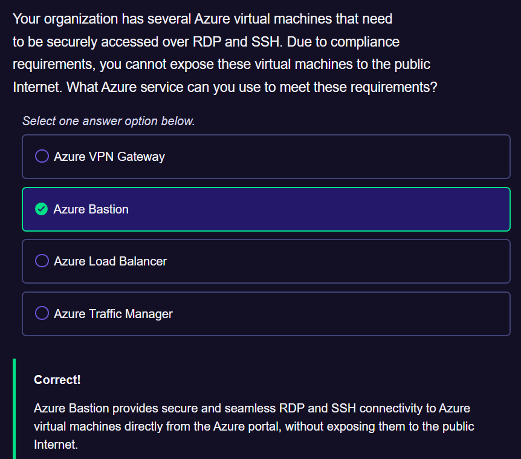
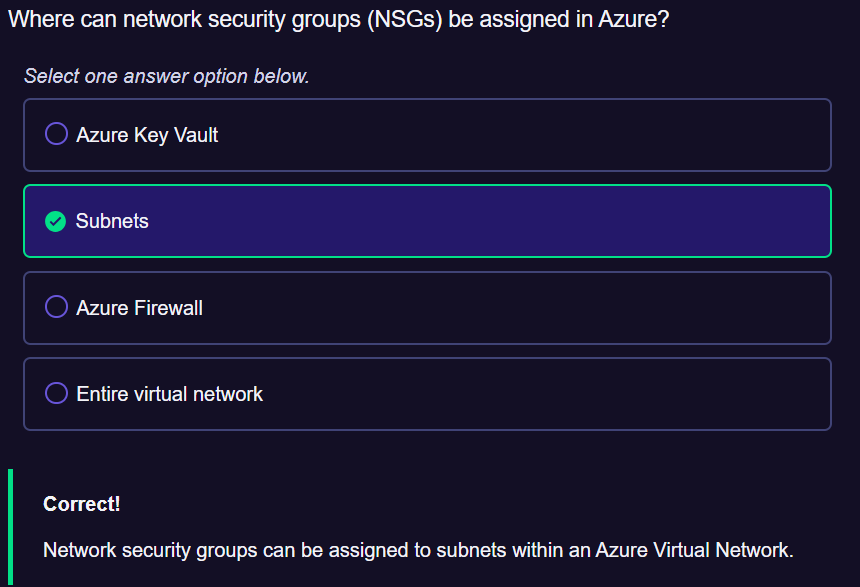
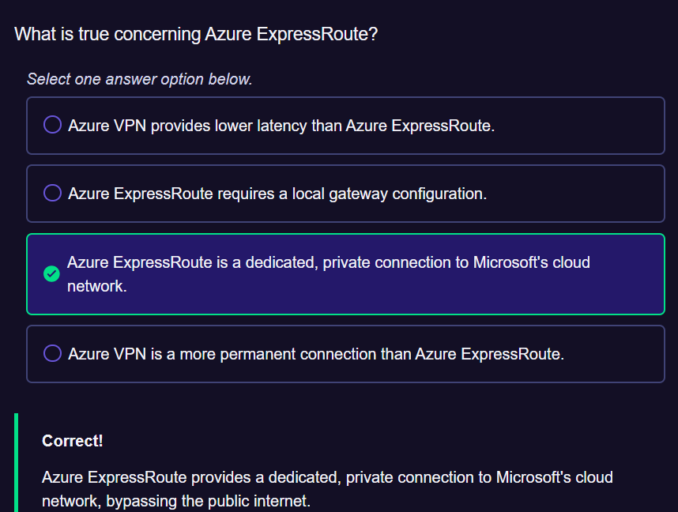

# Azure Storage
## Introduction to Azure Storage
### Storage accounts
They are management layer for Azure Storage services
=> Configures performance, security and access settings
=> Include multiple storage services (blobs, files queues, tables, disks, data lake, multiple instances of each storage service type)

Provides unique namespace to all storage objects

### Storage accounts and storage services
MyStorageaccount (Management layer)
=> Storage Services (Blob container, Table, FIles, Queues)

### Storage services
Different storage solutions for different types of data within a storage Account
- Azure Blobs : object store, any file type
- Azure Files : Managed file share (file server)
- Azure Queues : Messaging store between application components
- Azure Tables : NoSQL tables
- Azure Disks : Managed VM Disks, not managed in Storage account

### Unique Namespace for storage account
Account name must be globally unique
=> namespace given for all endpoints/storage services
=> lowercase and numbers only
=> every storage service has its own address

## Azure Blobs
### Definition
Unstructured data storage
Any file type

Binary large object => Any file
Can store massive amounts of data (petabytes of storage)
Blobs stored in containers
Multiple storage tiers to balance performance/cost
Don't need to pre-provision space. Charged by actual space used

### Blob Storage Layers
Storage Account => Containers => Blobs (logs, videos, txt, photos, pdfs)

### Web access for blobs
Each blob has a web address
Blobs can be private or public (private by default)
Address format (Example : https://mystoragecount.blob.core.windows.net/images/funycat.jpg => container name : images, blob : funnycat.jpg)

### Types
- Block : store text and binary data up to about to 4TB. Made up for individually managed blocks of data.
- Append : Block blobs that are optimized for append operations. Works well for logging whre data is constantly appended
- Page : Store files up to 8TB. Any part of the file could be accessed at any time. for example, a virtual hard drive.

### Use cases
Images for public website : single image storage location for all sizes and formats
File storage : though not a file server, an still act as file storage location
streaming : stream audio and video directly from your blob storage
log files : write to log files regardless of size and frequency
data store : store any kind of data at scale, such as for archiving, backup, restore and disaster recovery
data analysis : data storage for Azure or other data analysis products

## Blob Storage Tiers
### Problem to solve
Expanding storage needs : higher costs
- Not all stored data needs frequent, instant access
- Data accessed less frequently = wasted money

Solution : Optimize costs with tiered storage based on access needs.

### Types
Online :
- Hot : Frequently accessed data
- Cool : less frequently accessed (minimum retention days : 30 days, every 3 days)
- Cold : even less frequently accessed (minimum retention 90 days)
Offline :
- archive : rarely accessed, if ever (minimum retention 180 days)

### Balance storage costs with usage/retention costs
- Cheaper storage tiers have higher minimum retention + higher usage costs : minimum retention : how long data must exist before deletion
- Accesing cheaper storage tier data has extra cost : frequently accessed data needs to be hot tier

### Archive storage tier
Only not instantly accessible option
- Offline data for VERY rare access needs
- Archive data must be rehydrated (must request data to be brought back online, rehydration time measured in hours, rehydration request has additional cost)
- Archive scenarios (long term compliance archiving, legal hold data)

### Configuring Storage Tiers
- Storage Account vs blob-level configuration
(Account-level : default tier for new objects : hot/cool, Blob-level all levels)
- Existing blobs can chang tiers : example hot -> cold

### Scenarios
Hot : real-time analytics data, website images/videos
Cool/Cold : Short term backups, seasonal data
Archive : Medical records, historical data

## Creating an Azure Storage Account and Blob Container
### create a Storage Account
- Naming requirements : globally unique and lowerspace
- Default storage tier options
- Redundancy and premium options

## Disks
### 
### 
### 
### 
### 
### 
### 
### 
### 

## Azure Files
### 
### 
### 
### 
### 
### 
### 
### 
### 

## Tables and Queues
### 
### 
### 
### 
### 
### 
### 
### 
### 

## Storage Redundancy
### 
### 
### 
### 
### 
### 
### 
### 
### 

## Moving Data in Azure Storage
### 
### 
### 
### 
### 
### 
### 
### 
### 

## Additional Migration Options
### 
### 
### 
### 
### 
### 
### 
### 
### 

## Premium Performance Options
### 
### 
### 
### 
### 
### 
### 
### 
### 

## Exam Tips
### 
### 
### 
### 
### 
### 
### 
### 
### 
