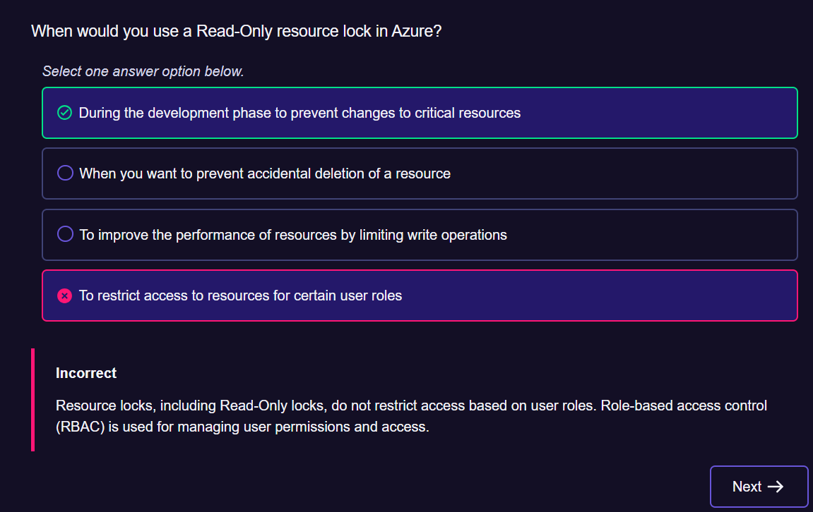
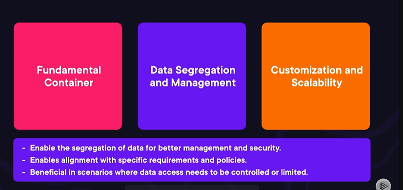

# Course Overview

# Exam Overview

# Describing Cost Management in Azure

## Defining Cost Management in Azure
### What is cost management?
Set of financial tools available to anyone with access to a billing account, subscription, resource group or management group

The processes involved in planning evaluating and controlling the budget of a project or business

In Azure, it involves understanding and controlling where and how resources are being used and billed.

### Why cost management in Azure Matters ?
Unmonitored cloud expenses can lead to significant unplanned costs

Cost management ensures:
Predictable monthly bills
Efficient use of resources
Reduction of waste
Improved financial forecasting

### Azure Cost Management Tools
Azure CMB : Azure Cost Management and Billing allows viewing, analysing and optimising costs
Azure Advisor : personalised best practices to reduce costs
Azure Budgets : Set budgets and create alerts to monitor spending

## Subscriptions in Cost Management
### What are subscriptions ?
An agreement with Microsoft enabling access to its cloud services. Highest logical billing container

A boundary that delineates resource usage,access and billings

### How subscriptions relate to cost management

subscriptions = running tabs
every azure service consumed is billed to its associated subscription
at the end of the billing cycle, the "tab" is due.

### Azure Hierarchy Review
Management group have multiple subscription groups. Inside of a subscription, multiple resource groups. Inside a resource group, multiple resources.

###
### Subscription Offers
Pay-as-you-go: Pay for whqt is used without upfront costs
Enterprise Agreement - Commit to a certain level of usage in exchange for discounted rates
Azure Dev/Test - Discounted rates for development and testing environments, excluding production workloads
Free Account : Limited number of free services for a limited time and continuously

### Subscription Pricing Models

Reserved Instances
Spot pricing
Hybrid use benefits

## Factors that Influence Cost
Knowthe context of cost-saving measures
Commit whereit makes sense
Leverage the tool available to forecast what cost might be

### Resource types
VMs billed based on comput,memory, storage, OS and time
Storage account - billed based on type (blob, file, disk, etc) and redundancy (local, regional, global)
Data transfers - inbound data is usually free, outbound costs
Databases - billed based on transactions and/or dedicated resources (depends on the type of the type of database)

### Location / Region
Azure is a global cloud offering
Variation can be influenced by: local regulations, energy costs and demand within the region or data centers
Consider deploying to lower cost regions but always consider latency and data residency

### Service Tiers
VMs (Basic vs Standard, Optimization (general purpose, memory, GPU), Std Hard Drive)
Storage accounts Blob (std vs prem), Files (prem, hot, cold), data lake (std vs prem), hdd vs SSD (std, prem, ultra)
Database : single vs elastic pool, vcore vs DTU, GP (general purpose), BC (business critical), Hyper, Provisioned vs Serverless

Tier selection is a balance between cost and functionality requirement matters
Know your requirement first to know how to navigate

### Reserved instances
commitment = savings
certain Azure services for a duration (1 or 3 years) in exchqnge of discounted rates, significant savings compared to pay-as-you-go pricing, requires upfront commitment,so assess your long-term needs carefully.
Significant savings compared to pay-as-you-go pricing
Requires upfront commitment, so assess your long-term needs carefully
Predictable, steady-state workloads are prime candidates for Revervd instances

### Azure Hybrid benefit
Harness On-premises benefits exploiter les avantages sur site
leveraging on-prem licenses
different support tiers come at different costs
add-ons, extensions or third-party services

## Azure Pricing Calculator

### Forecasting your cloud expenditures

### Your first step to cost prediction
Product tools
Product categories
Product Picker

### Building your azure financial plan
Consider the type and scale of your deployment requirements and input them into the calculator
Experiment with flexible requirements (tiers, instance types)
Be aware of your hard requirements (regions, data transfer needs)

### Deciphering the calculator's output
Cost breakdown : Visualization, Time period (daily, monthly, yearly)
Monthly Cost Estimate : Fixed vs Variable, peak costs, reservations, discount
Other costs : Data transfer, Bundled pricing, Licensing, Support, Add-ons

### Refining your financial forecast
Export results to formats that can be integrated into financial tools and/or shared
Adjust various parameters to discover cost-saving (scaling, regions, instances, etc)
Use the estimate in larger cost management strategy
Set budget, monitor costs and continually optimize

Azure advisor for recommendations

### Common mistakes
- Overestimatin resource needs : start small and scale up if needed
- Forgetting data transfer costs
- Ignoring price variations by region
- Not factoring in (or assuming) discounts

### Tips for more accurate estimates
- Regularly update usage patterns
- Factor in growth
- Use Azure's pricing examples
- Stay up to date with pricing changes

## Using the Pricing Calculator

Great for estimating what your cloud cost could look like
excellent way to explore the question "what if I deployed a"
should not be taken as a quote for costs

## Azure Total Cost of Ownership (TCO) Calculator

### Understanding Azure TCO Calculator
Tool provided by Microsoft to help businesses determine the cost benefits of migrating to Azure by comparing the costs of their o-premises infrastructure wih Azure services

provide a comprehensive cost estimate thatconsiders not just direct costs but also indirect costs (labor, utilities, licensing)

### How the TCO Calculator Works
Input => Adjut => Assess

### What you need before starting
Accurate data gathering
Leveraging inventory tools and methods
ensuring accurate assessments

### Common pitfalls
Incomple inventory
Ancillary Costs
Overlooking growth
Licensing oversights

Planning, evaluating and deciding to move on-premises to Azure premices

## Cost Management Tools
### Azure Cost Management and Billing
Dashboard : monitor, allocate and optimize costs

### Cost management components
Cost analysis : breaks down costs to understand spending patterns
Budgets : set spending limits and monitor expenditures against the set thresholds
Cost alerts : be notified when spending exceeds predefined limits

### Azaure Advisor
analyse deployed services and usage patterns to provide personalised recommendations
offers suggestions specifically for reducing costs,such as identifying idle resources or recommending reserved instances
recommendations for security,reliability, operational excellence and performance

### Azure Billing zithing cost management
Track your costs
see where your costs are coming from using the various logical groupings within azure

### A Suite Designed for a sweet deal
Cost Analysis
Budgets
Cost alerts
Azure Advisor

## Azure Budgets and Reservations
### Mastering financial management in Azure
optimal utilization of resources and financial efficiency
budget and reservations => mitigate cost sprawl

### Tagging in cost management
name/value pairs
categorise resources by purpose, owner,...
filtering of resources in cost analysis reports

### Azure reservations
prepaying for one or three years of specific Azure resources => cost saving

### 
###

## Azure Cost Allocation and Recommendations
### Cost allocation reports
detailed breakdowns of Azure costs based on specific criterio
### Azure Advisor
Personalized cloud consultant
personqlized best practices
cost, security, reliability, performance
Free !

=> Optimizing your azure financials

###
###
###

## Best Practices
###
###
###
###
###

## Exam Tips

Cost Management in Azure is understanding and controlling zhere and how resources are being used and billed

Unmonitored cloud expenses can lead to significant unplanned costs

Azure Cost Management & Billing, Azure advisor and Azure Budgets

Azure hierarchy include Management Groups to help manage subscriptions

Factors that influence cost :Resource type,Location, Service Tier, Hybrid Benefit, Reserved Instance

Azure pricing calculator : used to estimate cost of azure resources and services => Forecast, Plan, Refine

Azure Total Cost of Ownership (TCO) : financial cost of the cloud: assessing when it makes sense => Full assessment, Plan, Prioritize

Cost Management Tools: Cost Analysis, Budgets, Cost Alerting, Advisor

Azure Budgets and Reservations : maximizing return on Azure investments
monitor your reservation with azure cost management
Modify reservations based on evolving needs
review and adjust based on newly discovered usage patterns

Azure Cost allocation and recommendations
Tag + Advisor

Best practices

Integration with azure tools (Azure cost management, Azure policy)
Effective tagging : project, department/owner

# Features and tools for Governance and Compliance
## Defining Governance and Compliance
Governance : structure azure environments
decision making model around how Azure managed and accessed.
implementing policies and initatives to enforce organiwational requiremnets

Compliance: regulatory and organizational adherence

Governance as a Foundation : provides the framework and boundaries for operating within Azure
Compliance as a checkpoint : ensures that the product meet external and internal standards

## Revisiting Azure Hierarchy
Effective Organization promotes effective Governance
provides granular control over resources
maintains an organized structure
layered approach to governance

core of Azure hierarchy:
management groups handle subscriptions
subscriptions contains resource groups
inside each resources groups there is multiple resources

Inside of management group interface:
governance applies in tenant Root level which is for organiwation-wide application

The management group level is for broad level application : applies by default to all Subscriptions, Resource Groups and Resources

The subscription level is often for department, customer or project level application.

Hierarchy principles
Azure hierarchy structure provides granular governance management
Resources inherit what is applied at higher levels
Target regulatory compliance that refers to environments

## Azure Policy
Service that enables the creation, assignment and management of policies to enforce rules and effects over Azure resources and services.

Two components of policy
Conditions :
- Parameters : what the policy is performing
- Assignment : where the policy is performing
Effects :
- Audit : check if something is true or false
- Enforce : Make sure the audit requirements are applied

Policy definition is defined in a JSON file:
- displayName and description can gives clues to policy
- if/then components that are ty
- id/type

It can be advantageous to detect the type of Json file

without Azure Policy there is no governance or compliance in Azure

## Restricting Resource Access with Resource Locks
### Preventing unintended changes
Prevent accidental deletion or modification of critical resources.

### Resource Lock Types
Read-Only: Allows viewing of a resource but not modification
Delete: Prevents the resource from being deleted but allows modification

### Resource locks scopes
Subscriptions level
Resource groups level
Individual groups level

### Applying Resource Locks
Can be implemented using : Azure Portal, Azure CLI or Azure Powershell

### Resource Read-Only vs Delete differences
Read-Only : for resources where chqnges could be disruptive (like production databases)
Delete locks : For resources thqt should not be deleted by may need regular updates (like a virtual network)
Locks applied to all the resources that are inherited within a scope

### Resource Lock in Practice
- Protecting production environments
- Maintenance windows

### Managing resource locks with policies and automation
- Integration with Azure Policies
- Automated Lock Management (automated lock within business hours)
- Audit and compliance

## Using Azure Policy and Resource Locks

An initiative is a number of definitions brought together for a specific purpose

## Publishing Governance and Compliance
### Tracking and Reporting for Compliance
Robust reporting helps to ensure governance and meet compliance requirements
Compliance status, resource utilization and audit logs are all reports relevant to governance
Knowing Azure's reporting capabilities for governance and compliance is half the battle

### Essential tools for Governance reporting
Azure Monitor: collect analyze and act on telemetry data
Azure activity log: audit operation and changes in/to Azure resources
Azure Security Center: provide unified security management
Azure Policy : enforcement and reporting of enforcement

### A Unified Data Governance Service
helps to manage and govern on-premises organization

## Microsoft Purview
### Navigating the data governance landscape
Comprehensive data governance solution that extends across all data sources, whether on Azure, other cloud environments or on-premises.
provides visibility, data discovery and governance

### Centralizing Data Governance and Discovery
Automate the Data discovery and classify it
Data Mapping and cataloging :easy search
Data Lineage

### Ensuring Regulatory Adherence
Compliance Tools : provides a robust framework for compliance

Risk Assessment : assess and mitigate risks within an organization. Mitigation strategy 

Reporting and Insights : Detailed compliance reports 

### Integration and Extensibility
Seamless Integration : Integrates a wide range of data sources across cloud ecosystems and platforms.
Leveraging AI and Automation : data discovery and governance capabilities enhanced with AI and ML

## Securing Resources with Microsoft Defender for Cloud
### What is Microsoft Defender of Cloud
Assess, evaluate and actualize the security posture of environments
Capable of working with major cloud providers (GCP, AWS, )
Extend into private and hybrid data centers

### Security Posture
Observation (Visibility and accessibility) / Evaluation (Auditing and alerting) / Remediation (Point-in-time and continuous)

### Cloud Security Posture management (CSPM)
Visibility : security requires being seen
Assessment : security requires being evaluated
Recommendation : security requires being changed

### Cloud Workload Protection Platform (CWPP)
Monitoring : security requires diligence
Alerting : Security requires rapid notice
Remediation : Security requires action

### Seing the broad picture
- CSPM : Connect your resources, evaluate against best pratice, comply with industry requirements, initiate plan for alignment
- CWPP : inspect your resources, evaluate costs, point-in-time remediation, real-time assessment

### A Multi-cloud CSPM and CWP
Connect platforms with multiple cloud
Unified security
Consistent Action

### Three Vital needs when securing environments
- Assess : Evaluate, report and recommend
- Secure : Align to requirements
- Protect : Observe, alert and remediate
Cylical process

### Four Features of Microsoft defender for Cloud
Assess and strengthen : See your assets and know what their current posture is

Manage compliance : Compare your posture to industry standards

Enable threat protection : Use tools to send critical information from resources

Detect vulnerabilities : Automated response to security issues that arise

## Understanding Governance Reports in Purview and Defender for Cloud

### Explore Microsoft Purview Interface
### Explore Microsft Defender

## Exam Tips
Structuring Azure environments

# Monitoring and Security Management Tools in Azure
## Monitoring and Management in Azure
### Fundamentals of Monitoring and Management in Aure
- Role : Cloud Health, Service Delivery
Scope & challenges : Broad spectrum, cloud complexity 
Benefits : Operational Excellence, Strategic decision making

### Approaches of Monitoring in Azure
- Proactive : Anticipating and addressing issues before they become problematic
- Reactive : Reacting to issues after they have occured

### Effective resource management strategies
- Resource Organization and Governance : Structured Approach, Policy and Compliance
- Automation and Efficiency : Reduce Manual Tasks, Consistent Management
- Compliance and Security Management : Continuous monitoring, integrated security

### The significance of monitoring and management in Azure
An integrated approach to monitoring and management, combined with proactive strategies and responsive actions, is necessary for a robust and reliable cloud environment.

Continuous learning and adaptation is also necessary as both threats and tools evolve.

## Azure Automation
### Technology Recap
Azure Automation is a set of tools to automate complex and repetitive tasks.
Capable of integrating with Azure and non-Azure tooling.

### Automating security Management
Azure Automation can : perform automated security response, enforce policy, report configuration sprawl, implement desired state configuration

### Compliance Monitoring and Reporting
- Automated Compliance Checks : Perform regular compliance checks for adherance to regulatory standards and internal policies.
- Reporting Automation : Automatically generate and distribute compliance reports for increased transparency.

### Enhancing Governance with Automated workflows
Resource Lifecycle
Workflow standardization

### Impact of Azure Automation on Governance
Optimizing Governance in the cloud
Automated patching enhances security management
Automated reporting aids in governance
Automated security response mitigates threats
Standardized workflows provide consistent approach

### 

## Azure Advisor
### Want some free advice ?
Personalized cloud consultant
- Provides guidance around best practices
- Offers suggestions on cost optimization
- Recommends performance improvements
- Brings attention to possible reliability concerns
- Notifies of potential security vulnerabilities

Essential aspects of Azure proactive cost management

## Azure Monitor Overview
### Integrated and Centralized Monitoring
collectin, analyzing and acting on telemetric data
Monitor everything
Respond by various capabilities support acting on monitoring information in many ways
Understand the Big Picture

### Real-World Application and Integration
Metrics Explorer
Azure Monitor Logs
Activity Logs
Application Insights
Monitoring Insights
Alerts and Action Groups

## Survey Resource Alerts Using Azure Monitor

## Log Analytics
### Definition of Azure Log Analytics
Tool within Azure Monitor
Collects and analyzes telemetry data
IT Operations, troubleshooting

### Data collection
Source from Azure resources and services (VM, storage, database, logs)
Gather event logs, performance metric, application logs, error logs
Agent-based or Agentless collection depending on the source
Data consolidaton and storage via Log Analytics Workspaces
Configurable to specific sources, frequency, retention, etc

### Query Language - Kusto Query Language (KQL)
- Designed to be easy to read and understand
- Perfrom complex data analysis tasks (time series analysis)
- Analyze both real-time and historical data
- Create custom dashboards and visualizations

Also used in Azure Monitor and Azure Sentinel

### Integration with Azure services
Azure Sentinel : Security seal and events management
Azure Automation : 

### Workspaces in Azure Log Analytics
Fundamental container

Data segregation and management

Customization and scalability

### 

## Azure Monitor Alerting
### Definition Drop
Automatically notifying users or triggering actions based on specific metric or log data conditions in Azure resources
Proactive management of health and performance

### Types of Alerts in Azure Monitor
Metric : Alert on real-time metrics for Azure services
Log : Trigger based on the results of a log query run at regular intervals
Activity : Alert on Azure subscription-level events

### Components
Target resource : Azure resource or service to monitor
signal : specific action that triggers the alert
Threshold : Example : CPU usage over 50% for 5 minutes
Action group : The specific actions to perform
Severity Level : Classifying alert (0 to 5, critical to low)
Alert Rule State : 

### Action Groups
A collection of actions to be executed when the alert is triggered

### 
### 

## Application Insights
### Definition
application performance and monitoring
performance, availability and usage of web applications

### Core features
Telemetry Data Collection : Page views, user sessions, performance metrics

Analytics Tools : KQL, application map, user flows, live stream metrics, more

### Integration with applications
SDKs : Web, Desktop, Mobile
Performance : Real-time monitoring, Live Metrics Stream

### Proactive Diagnostics and Alerts
Automated alerting : Create alerts for performance and availability
Smart Detection Feature : Automatic identification of performance anomalies

### Visualizations and Reporting
Interactive dashboards : Visualizing telemetry data and application performance
Analytics Integration : Leverage Power BI for reporting and analysis

### 
### 
### 

## Azure Service Health
### Definition
Health tracking in Azure
personalized health dashboard
real-time and historical

### Key features of azure service health
Azure Status : Global health of Azure services
Service Health : Personalized alerts and guidance
Resource Health : Deeper look into individual resource health 

### Azure Service Health Alerts
Proactive incident and maintenance notifications
set up alerts
stay informed quickly

### Integrating Azure Service Health with Other services
Azure Monitor
Azure Advisor 
Example : Service Health to trigger alerts in Azure Monitor and to have recommendations from Azure Advisor

## Understanding Azure Monitor Alerting

### 
### 
### 
### 

## Expanding Management with Azure Arc
### Definition
Extending Azure Management
Designed from cross-environment
Multi-cloud
On-premises
Hybrid
Edge

### Core components and Features
Servers
Kubernetes
Azure data services: cloud, on-premises, edge
SQL Server : extend azure service
Virtual Machines

### Benefits
Unified Management: consistent management and governance across all infrastructures
Flexibility in deploying Azure services anywhere

### Use Cases of Azure Arc
Managing servers across on-premises and multi-cloud
Implementing Azure data services in a hybrid environment

## Exam Tips
Continuous learning

### A Robust Azure Env
### 
### 
### 
### 
### 
### 
### 