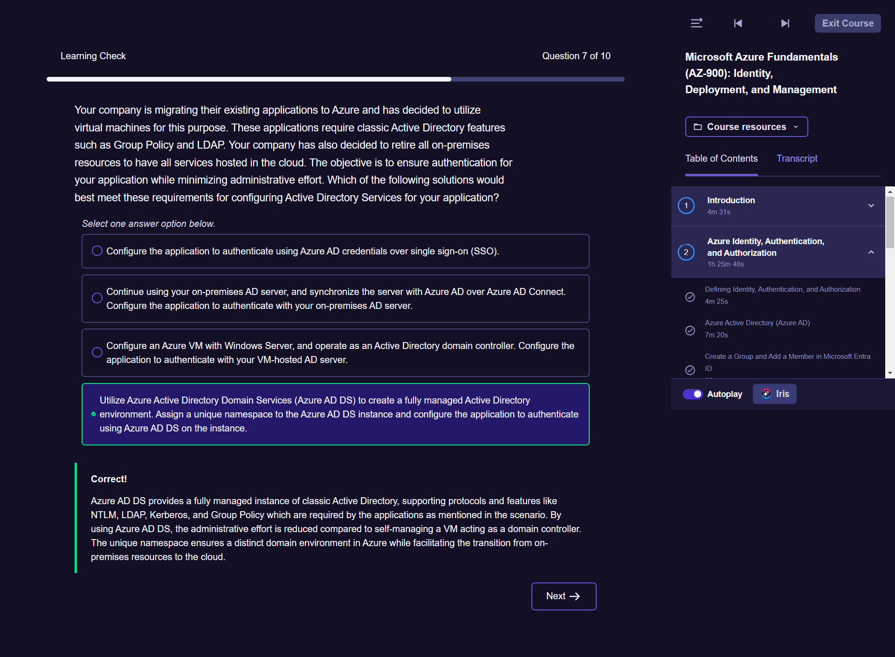
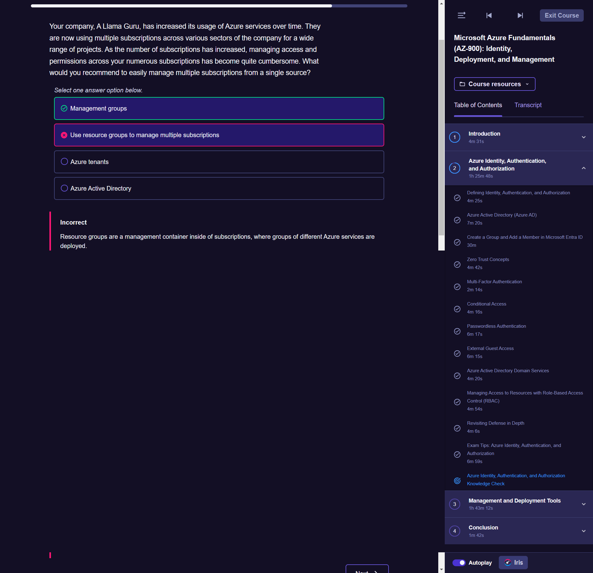

# Exam overview

AZ900 starting point for a career in Azure. Entry-level Azure exam prove knowledge of cloud concepts and Azure services. For both IT experts and busines leaders

# Course overview

Identity, Deployment And Management : what each of these means and how they are accomplished in Azure, describe the tools used for each concept, launching point for pursuing specific areas of Azure

# Defining Identity Authentication and Authorization

## Scope Definitions
Identity : who or what I am
unique identifier for any digital object

Authentication : the proof of who/what I am
proves identity

Authorization : where I can go and what I can do
scoped identity

## Examples

### Identity
Physical world : passport, driver's license, hospital ID
Digital world : Azure Active Directory (AD) object, software license, email ID

### Authentication
Physical world : house key, certificate or authenticity, safety deposity box password
Digital world : SSH key, SSL certificate, Email account password

### Authorization
Physical world : Event ticket, Gate-specific key code, Key card
Digital world : Application secret, Shared access signature token, Key card

## Management

All the resources and services available in Microsoft's cloud offering

Azure AD : service for managing identity, authentication and authorization => Microsoft Entra ID

# Azure Active Directory

## Microsoft Entra
New product family
AD is a key component of Entra
Other components are : Permissions management and Verified ID
Exam perspective : Know that Azure AD is part of the broader Microsoft Entra product family

## Directory Services
Azure Active Directory Domain Services
Azure Active Directory (now Microsof Entra ID)

## Azure AD vs AD

Az AD : Modern office solution and designed for modern web, using modern authentication
Modern architecture, protocols and methods
Cloud native design

AD: Legacy office solution designed for legacy web and using legacy authentication
Legacy architecture, protocols and methods
On-premises/datacenter design

AZ active directory domain services : managed service for an AD to use modern 

## Entra ID
Active Directory is not Microsoft Entra ID

## Characteristics
Requirements :
- Every azure account automatically has an Azure AD instance with it
- Every Azure AD instance needs at least one user and this user is created with the initial Azure AD instance
- Custom domain name
- Azure AD Connect (if on-premises AD present)

## Organization
Tenant : represents the organization. It is dedicated instance of Azure AD that an organization receives when signing up for Azure. Each tenant is distinct and completely separate from other Azure AD tenants, Max 500 Tenants : each user in Azure can be a member or guest of up to 500 Azure AD/Microsoft Entra ID tenants

Subscription: All resources within a subscription are billed together, you can have multiple subscriptions within a tenant to separate costs + if a subscripion isn't paid, all the reources and services associated with the subscription stop. => a billing entity

On-Prmises => Azure AD => Azure
Azure AD/ENtra ID can help manage users in a hybrid organization

## Create a group and add a member in Microsoft Entra ID
EID : Entra ID

Search Microsoft Entra ID
Click on Groups then on display all groups
Fill the blanks (Name and description) by leaving Group type as Security
Click on Users
Create new User
Go to groups add members or owners

## Zero trust concepts
classic trusted vs untrusted model are not well suited for many modern 
pusheds trust to the individual level

- Trusted perimeter
Trust boundary for secure access
Example : Corporate Network
Must be on corporate network to access resources
Use VPN as an extension of trusted perimeter

Zero trust : all users assumed untrustworthy unless proven otherwise (trusted by identity, regardless of location, least privilege access, simplified, centralized management)
In action : Access Microsoft 365 email, documents and resources for remote workforce, centrally control access with conditional access policies (access from anywhere, authenticate with identity), allow access only from approved managed deices (independent from network location)

## Multi-factor authentication

MFA Model : Something you know, sthg you have, sthg you are
=> MFA Example : validate what you know (username/password), validate what you have (phone validation)
MFA provides layered security for user identity
requires at least two components of sthg you know/have/are

## Conditional access
feature that provides additional layer of security to your environments and identity
its rules are essentially if/then statements that permit or deny access depending on whether the rules are met.
MFA is often implemented with conditional access as further security.

Authentication protections beyond username/password

if/then policy to grant access : if user meets these conditions
often paired with MFA

Create conditional access policy : assign signals (conditions : users/groups, application to grant/deny access, location, approved devices), access decisions (grant/block access, require MFA)

Scenarios : Enforce MFA for all administrators/users, block sign-ins using legacy authentication protocols, grant access only to specific locations, require organisation-manage devices for application sign-in

## Passwordless authentication

### Security vs Convenience
More steps required to log in

### One possible solution
Password is removed: replaced by sthg I have (phone or key fov), sthg I know (fingerprint) => Increase convenience while staying secure

Password only : more convenient but low security
Password + MFA : inconvenient with high security
Passwordless authentication : convenient with high security

### Methods
MFA application : Microsoft MFA mobil app (Configure in Azure AD), authenticate with biometric
Windows Hello : face recognition in Windows
FIDO2 Security Key : hardware key

### Example
Log in to Microsof 365 qnd enter username
Instead of a password, prompted to check Microcsoft Authenticator
Use the biometric/PIN in the authenticator app

## External Guest Access
=> enables security outside of your organizational boundaries
=> provides visibility of external guest activity within your organizational IT borders

### Challenge
How do you interact with external users ?
=> consultants and customers in a streamlined Azure or Entra ID/ Azure AD configuration

Solutions :
- New IDs for every external user
- Current IDs for every external users

Azure AD B2B : Entra external ID for partners
=> Designed for interacting with internal resources
=> User has an identity inside of Entra ID/Azure AD that can be managed by your org

Azure AD B2C : Entra external ID for customers
=> Designed for interacting with externally facing resources like applications, websites, etc.
=> User's identity is managed by whatever their provider is (Microsoft, Google, Facebook, etc)

### Azure AD B2B : Entra external ID for partners
External user already has an ID with another service or provider
Your organization initiates an invitation to that external user's ID
External user accepts the invitation, and a user object (ID) is created inside your org based on that external ID
=> provides a federated level of trust for tenants

### Azure AD B2C : Entra external ID for customers
External user already has an ID with another service or provider
External usr is provided the option to use their existing ID
External user alogs using their current ID with their provider, and that authorization is passed into the application via a B2C directory.
The organisation trusts the external user
=> allows for improved integration with customer systems

### Adding a guest user
Invite a variety of account types
Assign permissions for guest account
Optional: Assign guest user to application
Optional: Apply cross-tenant conditional access policy

### Inviting an external consultant
Configure identity provider (if non-Microsoft)
Invite external party
After guest user accepts invitation, assign permissions

## Azure Active Directory Domain Services

### Limitations Entra ID/Azure AD and Cloud Migrations
Legacy applications unable to use modern authentication protocols

### Possible Solutions
Continue using on-premises AD : Sync to Entra ID/Azure AD with Azure AD Connect
Configure AD Server on Azure VM (also known as self-managed AD DS) : You maintain/configure the operating system
Azure Active Directory Domain Services : Managed Active Directory Domain Service, Provide classic AD Services

### How Azure AD DS Works
No need for os config/management
Create unique namespace/domain name
One-way sync from entra ID/Azure AD

### Example Azure AD DS

## Managing Access to resources with Role-Based Access (RBAC)

### Azure RBAC (Role-Based Access control)
controle access based on role (assigned to the user, devices)

### Azure RBAC Roles
Built-In roles for convenience
Custom roles for specificity

### Role Assignment
Scope: only the permissions necessary
Scope: only the resources/services necessary
Scope: only to individuals when absolutely necessary

### Inheritance
propagates permissions in a hierarchy
capability of custom roles to inherit permissions from other roles
application of permissions to a lower level organizational construct

instead of assign a role individually better assign individuals to a group where their roles are defined

### Best practices
Least privileges : only the permissions necessary
Use of roles : built in whenever possible; use custom roles with care
role segregation: separate duties and responsibilities, avoid combining roles that grant conflicting permissions or excessive access
resource or service scope: avoid permission sprawl
review, audit and document: check, double check; and write it down

## Revisiting Defense in Depth
Even at the identity level, layered defense is the best practice
Defense in
depth at the identity level can even play into application security
### Overview
mitigate or reduce unauthorized data access
method: layered defense => makes access difficult enough to access data

### Castle example
### Identity example

User => Password => MFA => Conditional access 

## Exam tips:
Identity: unique identifier for any digital object
Authentication: proves identity
Authorization: scopes identity
Azure ID/Entra ID includes all three

Microsoft Entra is a product family that includes Azure AD/Microsoft Entra ID
AD is not the same as Azure AD/Microsoft Entra ID
Every Azure account will have an 

What is the name of the Azure component that is responsible for all interactions with Azure, including the Azure portal, programmatic access, and command-line interaction?
The Azure Resource Manager manages and controls access to all interaction with Azure.

